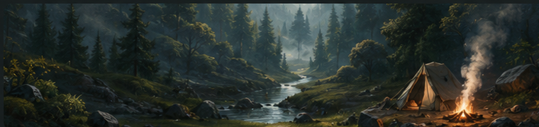

# 🌲 Wilderness Adventure – Streamlit Version

A browser-based survival adventure game built with **Python** and **Streamlit**.

The player wakes up alone in the wilderness after a heavy storm. The camp is destroyed, the way back is blocked, and survival depends on collecting resources, managing health and energy, trading with Tesla, and building a signal fire to get rescued.



---

## 🎮 About the Game

**Wilderness Adventure** is an interactive survival game where the player must make smart decisions to stay alive.

You can collect food, gather materials, trade rare goods, manage your inventory, and try to survive long enough to build a signal fire.

The game includes:

- Health and energy management
- Resource collection
- Inventory system
- Trading with Tesla
- Random events
- Score tracking
- Leaderboard
- Saveable game progress during a session
- Streamlit-based web interface

---

## 🧰 Technologies Used

- Python
- Streamlit
- Pillow
- JSON

---

## 📁 Project Structure

```text
wilderness-adventure-python-II-Streamlit-Version/
│
├── assets/
│   ├── forest_banner.png
│   ├── player_avatar.png
│   └── tesla_avatar.png
│
├── bestenliste.json
├── requirements.txt
├── streamlit_app.py
├── wildnis_core.py
└── README.md
🚀 Installation

Clone the repository:

git clone https://github.com/YOUR-USERNAME/YOUR-REPOSITORY-NAME.git

Go into the project folder:

cd YOUR-REPOSITORY-NAME

Install the required packages:

pip install -r requirements.txt
▶️ Run the App

Start the Streamlit app with:

streamlit run streamlit_app.py

Then open the local Streamlit URL in your browser.

Usually it will be:

http://localhost:8501
🕹️ How to Play

The goal of the game is to survive in the wilderness and build a large signal fire.

You can:

Collect food such as berries, fish, nuts, and herbs
Gather materials like wood and stone
Trade with Tesla for rare resources
Sleep to recover energy
Check your status and inventory
Build a signal fire
Try to reach the highest score on the leaderboard

Be careful: every action can affect your health, energy, inventory, and survival chances.

🏆 Leaderboard

The game stores scores in:

bestenliste.json

The leaderboard shows previous results, including player name, score, number of rounds, and game outcome.

📌 Main Files
streamlit_app.py

This file contains the Streamlit user interface.
It handles the layout, buttons, player status display, inventory cards, event log, and interactions.

wildnis_core.py

This file contains the core game logic.
It manages player actions, resources, events, scoring, survival rules, and game progress.

📸 Screenshot

The app includes a dark forest-themed interface with:

Main menu actions
Event log
Player status
Health and energy bars
Inventory overview
Quick food actions
Tesla trading panel
Leaderboard
✅ Requirements

The project uses the following Python packages:

streamlit
pillow

Install them with:

pip install -r requirements.txt
🌿 Future Improvements

Possible future features:

More random events
More characters and trading options
Additional survival locations
More crafting recipes
Difficulty levels
Improved save system
Sound effects and animations
👤 Author

Created by Lesley.
